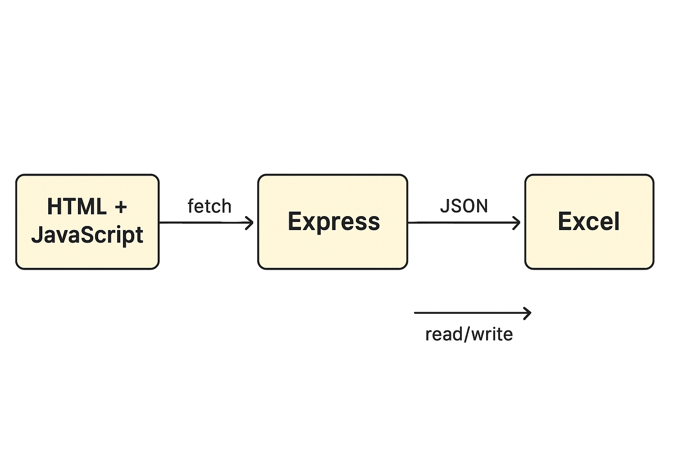
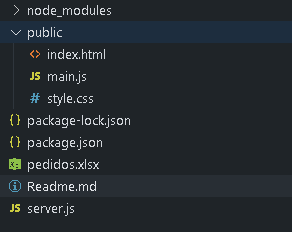

# PEDIDOS-AVISOS APP #

Pedidos-Avisos APP, consiste en una aplicación web desarrollada en HTML5, JS, CSS y BOOSTRAP. El proyecto fue creado mediante Node.js.

La aplicación cumple con dos funcionalidades:

- Gestión de pedidos de productos a proveedores
- Control de pedidos realizados por los clientes del negocio.

### Gestión de pedidos a proovedores: ###

El sistema permite gestionar los productos que deben solicitarse a cada proveedor, permitiendo agregar o eliminar de los mismos los productos faltantes o recibidos.

### Control de pedidos realizados por los clientes: ###

El sistema permite agendar los clientes que han solicitado productos y llevar el seguimiento del proceso de venta de los productos. Permitiendo agendar clientes con pedidos pendientes y entregados.

## Arquitectura utilizada ##

## DESARROLLO DE APLICACION EN ENTORNO DE DESARROLLO Y EJECUCIÓN ##

Inicialización en entorno e instalacion de dependencias.

>npm init -y
>npm install express body-parser exceljs cors  

- **express**: framework para armar endpoints y levantar un servidor HTTP.
- **cors**: permite que el navegador haga peticiones al backend sin bloquearlas.
- **xlsx**: librería para leer y escribir archivos Excel .xlsx.

## Ejecución y puesta en funcionamiento de la aplicación ##

El archivo iniciarServidor.bat es el responsable de iniciar el servidor y lograr una conexión entre el back y el front.

Se puede iniciar de todos modos desde el terminal dentro de la carpeta /proyecto-pedidos mediante el comando

    node server.js

### Avisos e información al usuario ###

Mediante modales de Boostrap y alertas, se mantiene un estado controlado sobre la información llevada a cabo y los errores de usuario, entradas en inputs o errores de tipeo.

